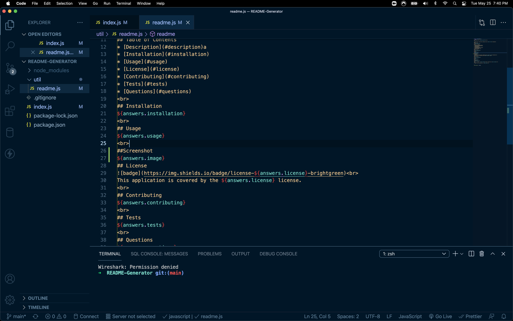

<h1 align="center">emmett</h1>
 

 
## Description
emmett
 
## Table of Contents
* [Description](#description)a
* [Installation](#installation)
* [Usage](#usage)
* [License](#license)
* [Contributing](#contributing)
* [Tests](#tests)
* [Questions](#questions)
 
## Installation
emmtt
 
## Usage
emmett
 
##Screenshot

## License
 
This application is covered by the GNU license. 
 
## Contributing
emmett
 
## Tests
emmett
 
## Questions
emmett
 
Find me on GitHub: [emmett](https://github.com/emmett) 
 
✉️ Email me with any questions: emmett 
    